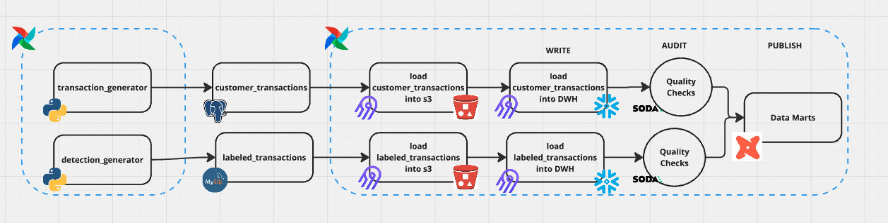
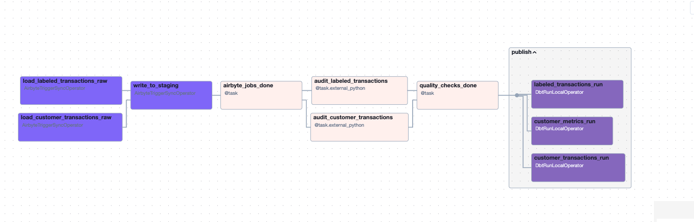

# Fraud Detection Project

Welcome to the Fraud Detection Project! This project demonstrates a data pipeline for processing, analyzing, and publishing fraud detection data. The pipeline integrates multiple modern data engineering tools and technologies to handle data generation, ingestion, transformation, and quality checks, ultimately publishing the results as data marts in snowflake dataware house.

---

## **System Architecture**

Below is the high-level architecture of the pipeline:



This is how the final DAGs look like in airflow:



The pipeline consists of the following stages:

1. **Data Generation:**
   - `transaction_generator`: Generates fake customer transaction data and stores it in a PostgreSQL database.
   - `detection_generator`: Generates fake labeled transaction data and stores it in a MySQL database.

2. **Data Ingestion:**
   - Airbyte is used to extract data from PostgreSQL and MySQL and load it into S3 as raw data.

3. **Data Loading:**
   - The ingested raw data is loaded into Snowflake Data Warehouse for further processing using airbyte connector.

4. **Data Quality Audits:**
   - Soda performs quality checks on the data in Snowflake to ensure data reliability.

5. **Data Publishing:**
   - Validated data is transformed and published into Data Marts using dbt for downstream consumption.

---

## **Technologies Used**

This project integrates the following tools and technologies:

- **Airbyte**: For seamless data ingestion from PostgreSQL and MySQL to S3.
- **Apache Airflow**: For orchestrating the end-to-end pipeline.
- **PostgreSQL**: For storing customer transaction data.
- **MySQL**: For storing labeled transaction data.
- **Amazon S3**: As a staging area for raw data.
- **Snowflake**: As the Data Warehouse for storing and querying processed data.
- **Soda**: For performing data quality checks on Snowflake tables.
- **dbt (Data Build Tool)**: For transforming data and creating Data Marts.

---

## **Pipeline Flow**

### **1. Data Generation**
- **`transaction_generator`**: Generates synthetic customer transaction data and stores it in PostgreSQL.
- **`detection_generator`**: Produces labeled fraud detection data and stores it in MySQL.

### **2. Data Ingestion**
- Data from PostgreSQL and MySQL is extracted and ingested into S3 using Airbyte connectors.

### **3. Data Loading**
- Data from S3 is loaded into Snowflake for storage and querying.

### **4. Data Quality Checks**
- Soda performs audits on Snowflake tables to validate data quality and ensure accuracy.

### **5. Data Publishing**
- dbt transforms validated data into analytics-ready Data Marts for use in fraud detection analysis.

---

## **Setup Instructions**

1. **Clone the Repository:**
   ```bash
   docker-compose up
   ```

2. **Set Up Airbyte:**
   - Configure Airbyte connections for PostgreSQL, MySQL, and S3.

3. **Configure Snowflake:**
   - Set up Snowflake credentials and database.

4. **Run the Pipeline:**
   - Trigger the DAG in Airflow to execute the pipeline end-to-end.

---

## **Key Features**

- **Scalable Design:** Integrates multiple tools for seamless data flow from source systems to analytics.
- **Data Quality Assurance:** Ensures reliability with Soda's automated quality checks.
- **Analytics-Ready Outputs:** Publishes structured and validated data in Snowflake for business insights.

We welcome contributions! Please fork the repository and submit a pull request with your improvements or ideas.


### The Airbyte connection to create in Airflow:

- Connection id: airbyte
- Connection type: Airbyte
- Host: airbyte-server
- Port: 8001
